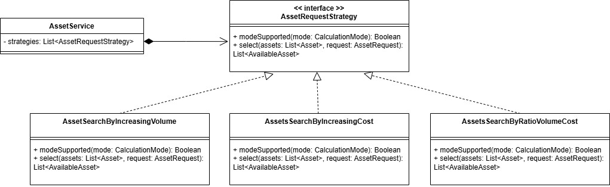

# FC Technical Test (Assets Selection)

## Subject

This technical test consists on the creation of an HTTP endpoint which receives a POST request to get a list of assets to activate.
The request needs 2 values to filter and select assets from the database:
- date : date of the activation
- volume : power needed for this activation in kW

The main objective is to return a list of available assets which can be activated to satisfy the power demand.
Each asset has an activation cost. So, one of the objectives is to minimize total activation cost.

In this test, multiple strategies have been implemented to compare results.

## Run

### Prerequisites
- Java 21
- Gradle
- Postman to communicate with the application

### Run application

In a bash terminal, in the root directory of the project, enter
```
./gradlew bootRun
```

The application starts with the following address:
```
http://localhost:8080
```

### Run tests

To run tests, in a bash terminal, in the root directory of the project, enter:
```
./gradlew test
```

## Communication with API

There is only one endpoint to communicate with the application, with a POST request to:
```
/assets/available
```

So, the full address is:
```
http://localhost:8080/assets/available
```

In Postman:
- in Header tab, you have to add 'application/json' value to 'Content-Type' key.
- in Body tab, you have to select "raw" and put JSON data with date, volume, and mode (optional):
```
{
  "activationDate": "2026-03-10",
  "requestedVolume": 100,
  "mode": "RATIO" //OPTIONAL
}
```

The mode is optional because "RATIO" mode is set by default, but you can select the following modes:
- "VOLUME": the available assets are sorted by volume increasing
- "COST": the available assets are sorted by cost increasing
- "RATIO": the available assets are sorted by cost per volume increasing


## Design decisions

### Strategy pattern

To compare results from different calculation modes, all modes are implemented using Strategy pattern:
- AssetsSearchByIncreasingVolume
- AssetsSearchByIncreasingCost
- AssetsSearchByCostPerVolume



This pattern allows to add another search algorithms without modifying others and each strategy can be tested separately.
We can select one of the strategies in the POST request.


### Domain-driven architecture

Structure of the project:
- controller : AssetController → receive the POST request, call the application (AssetService) and returns the response
- application : AssetService → verify if a strategy exists based on mode sent by POST request and call the domain class to perform calculation mode
- domain : Classes implements AssetRequestStrategy → filter the assets to found which are available at date in the request and perform the calculation to return list of available assets

There are 2 data class in the domain:
- Asset : describes an asset (code, name, activationCost, availability and volume)
- AssetRequest: describes an asset request (representation of the body sent by POST request) (date, volume, mode)


### Strategies

Different strategies have been implemented to compare them and found the best approach to select the best combination of assets with minimizing total activation cost

#### Search by increasing volume

This approach consists of sort available assets by increasing volume and add each asset until the requested volume is reached.
```
val availableAssetsSortByIncreasingVolume = availableAssetsAtDate.sortedBy { it.volume }

val assetsSelected = mutableListOf<AvailableAsset>()
var requestedVolume = request.volume

for (asset in availableAssetsSortByIncreasingVolume){
    if(requestedVolume <= 0) break
    val availableVolume = minOf(asset.volume, requestedVolume)
    assetsSelected.add(AvailableAsset(asset.code, availableVolume, asset.activationCost))
    requestedVolume -= availableVolume
}
```

The advantage of this strategy is its complexity O(n log n) so the execution time will be short even with a large set of assets.
But, if the volume requested is big and the number of assets is big too, this strategy can return a large list of available assets for a cost which can be large.

Simple example:
| Asset  | Volume  | Activation cost  |
|---|---|---|
| Asset 1  | 50  | 40  |
| Asset 2  | 60  | 50  |
| Asset 3  | 100  | 80  |

If the volume requested is 100, with this strategy, the assets selected are Asset 1 + Asset 2 for an activation cost of 90.
But, it's not the optimal solution because the Asset 3 has a volume of 100 with an activation cost of 80.
The optimal solution is to select only Asset 3.

#### Search by increasing cost

This approach is the same as increasing volume but with activation cost.

```
val availableAssetsSortByIncreasingCost = availableAssetsAtDate.sortedBy { it.activationCost }

val assetsSelected = mutableListOf<AvailableAsset>()
var requestedVolume = request.volume

for (asset in availableAssetsSortByIncreasingCost){
    if(requestedVolume <= 0) break
    val availableVolume = minOf(asset.volume, requestedVolume)
    assetsSelected.add(AvailableAsset(asset.code, availableVolume, asset.activationCost))
    requestedVolume -= availableVolume
}
```

This complexity of this approach is the same as increasing volume : O(n log n).
But, if the volume requested is big and the number of assets is big too, this strategy can return a large list of available assets for a cost which can be large.

Simple example:
| Asset  | Volume  | Activation cost  |
|---|---|---|
| Asset 1  | 50  | 20  |
| Asset 2  | 100  | 100  |
| Asset 3  | 150  | 110  |

If the volume requested is 150, with this strategy, the assets selected are Asset 1 + Asset 2 for an activation cost of 120.
But, it's not the optimal solution because the Asset 3 has a volume of 150 with an activation cost of 110.
The optimal solution is to select only Asset 3.

#### Search by increasing cost per volume

This approach consists of sort available assets with cost per volume increasing

```
val availableAssetsSortByCostPerVolume =
            availableAssetsAtDate.sortedBy { it.activationCost / it.volume.toDouble() }

val assetsSelected = mutableListOf<AvailableAsset>()
var requestedVolume = request.volume

for (asset in availableAssetsSortByCostPerVolume){
    if(requestedVolume <= 0) break
    assetsSelected.add(AvailableAsset(asset.code, asset.volume, asset.activationCost))
    requestedVolume -= asset.volume
}
```

The complexity of this approach is same as other : O(n log n).
This solution is a good approach for some configurations and requested volume:
| Asset  | Volume  | Activation cost  | Cost/volume  |
|---|---|---|---|
| Asset 1  | 10  | 5  | 0.5  |
| Asset 2  | 100  | 25  | 0.25  |
| Asset 3  | 40  | 10  | 0.25 |

In this example, the order of the sort is : Asset 2 → Asset 3 → Asset 1.
If the requested volume is 100, only Asset 2 will be returned for a total activation cost of 25.

BUT, if the requested volume is 110, the Asset 2 and Asset 3 will be returned for a total activation cost of 35.
OR, if we select Asset 2 and Asset 1, the volume is reached with a total activation cost of 30.

This approach is non-optimal for all configurations.

## Trade-offs and assumptions

### Trade-offs

- Assets are stored in-memory and not in a database
- Cost per volume strategy is better than others but not for all configurations
- The strategies complexity are O(n log n) so there are functional for large datasets

### Assumptions

- Availability is bases on date. A match is required car it's possible te not have assets available for a specific date.
- A better strategy to select assets can be found.
- An asset activation cost is fixed event if we use partial volume. It's useful to select assets which use partial volume close to the total volume to optimize cost.

## Testing

- The controller is tested with a mock to test if a POST request receive a response, and also watch when the request body is invalid
- Each strategy is tested with unit tests
- A test class has been created to compare results between all strategies with a randomized dataset generation


## Improvements

- A better strategy can be found to select assets with minimal total activation cost
- Use database instead of in-memory assets
- Optimization of sort to have O(n) complexity (with database)


